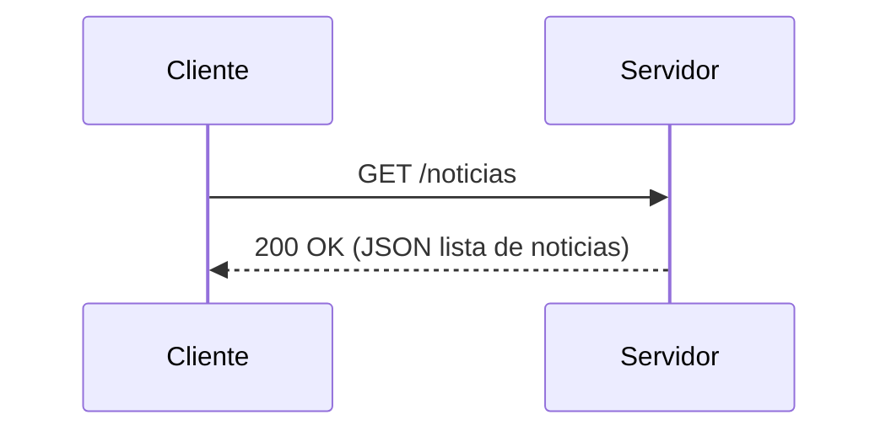

# Taller en clase: construyendo una API (guía paso a paso)

Este README está diseñado como una guía práctica y priorizada (de lo esencial a lo avanzado) que explica todo lo que necesitas saber para construir, ejecutar y entender una API HTTP. Incluye pasos de construcción, ejemplos, diagramas y buenas prácticas. Está en español y contiene comandos listos para PowerShell (`pwsh.exe`).

## Resumen rápido (para empezar en 2 minutos)

Requisitos mínimos: Node.js (14+), npm/yarn, Git y PowerShell.

En PowerShell, desde el directorio del proyecto:

```pwsh
# Instalar dependencias
npm install

# Ejecutar la aplicación
npm start

# Para desarrollo con recarga automática (si está instalado nodemon)
npm run start:dev
```

Si ves un mensaje como "Listening" o la app se inicia sin errores, ya está funcionando localmente.

## Estructura del repositorio

En este repositorio (ejemplo mínimo) tienes:

- `index.js` - punto de entrada de la aplicación (servidor Express).
- `package.json` - scripts y dependencias (usa `express`, `nodemon`).
- `README.md` - (este archivo) documentación.

Si añades rutas, controladores o persistencia, crea carpetas como `routes/`, `controllers/`, `models/`, `tests/`.

## Contrato mínimo (qué vamos a construir)

- Entrada: peticiones HTTP (GET/POST/PUT/DELETE) con parámetros URL, query o cuerpo JSON.
- Salida: respuestas JSON con un `status` HTTP adecuado y un cuerpo con datos o error.
- Formato de datos: JSON (Content-Type: application/json).
- Modo de error: devolver objetos con estructura consistente, por ejemplo:

```json
{
	"error": true,
	"message": "Descripción del error",
	"code": 400
}
```

## Contrato en 3 bullets (inputs/outputs/errores)

- Inputs: method, url, headers (incluido Authorization si aplica), body JSON.
- Outputs: status code HTTP, body JSON, headers (Content-Type, Cache-Control, etc.).
- Errores: 4xx para fallos del cliente, 5xx para errores del servidor. Siempre devolver JSON en errores.

## Paso a paso organizado por prioridad

1) Fundamentos / prerequisitos (imprescindible)

- Instalar Node.js y npm.
- Conocer cómo ejecutar comandos en PowerShell.
- Entender qué es HTTP: métodos, URLs, status codes, headers y cuerpos.

2) Instalar dependencias y arrancar (rápido)

- `npm install` para instalar las dependencias definidas en `package.json`.
- `npm start` arranca la aplicación usando `node index.js`.
- `npm run start:dev` arranca con `nodemon` para desarrollo.

3) Diseño de la API (conceptual)

- Endpoints: identificar recursos (por ejemplo `/noticias`, `/noticias/:id`).
- Verbos HTTP: usar GET para leer, POST para crear, PUT/PATCH para actualizar, DELETE para borrar.
- Versionado: incluir versión en la URL o en headers (por ejemplo `/v1/noticias`).

4) Implementación básica en Express (qué esperar en `index.js`)

- Crear una app Express, añadir middleware `express.json()` para parsear JSON.
- Definir rutas con manejadores que devuelvan respuestas JSON.
- Añadir manejo de errores centralizado (middleware de error).

5) Validación y seguridad

- Validar entradas (req.body, params, query) y devolver 400 si faltan campos o son inválidos.
- Proteger endpoints con autenticación/authorization (JWT, API keys) según necesidad.
- Evitar exponer errores internos (no enviar stack traces en producción).

6) Persistencia y estado

- Decidir si usar base de datos (SQL/NoSQL) o almacenamiento en memoria para pruebas.
- Separar la lógica de acceso a datos en `models/` o `services/`.

7) Pruebas y calidad

- Escribir tests unitarios y de integración (por ejemplo con Jest + supertest).
- Probar casos felices y errores (400, 404, 500).

8) Despliegue

- Preparar scripts de arranque, variables de entorno, y `Procfile` si usas Heroku.
- Contenerizar con Docker si lo deseas.

## Conceptos HTTP esenciales (con ejemplos)

1) Request / Response (flujo básico)

ASCII:

Client --> Server : HTTP Request (method, path, headers, body)
Server --> Client : HTTP Response (status, headers, body)

Mermaid sequence (si tu visor lo soporta):



2) Métodos HTTP (tabla corta)

- GET: obtener recursos (idempotente, no modifica servidor).
- POST: crear un recurso (no idempotente).
- PUT: reemplazar un recurso (idempotente si se usa correctamente).
- PATCH: modificar parcialmente (parcialmente idempotente según uso).
- DELETE: eliminar un recurso (idempotente).

3) Status codes comunes

- 200 OK — petición exitosa (GET, PUT).
- 201 Created — recurso creado (POST).
- 204 No Content — éxito sin cuerpo (DELETE o PUT sin respuesta necesaria).
- 400 Bad Request — datos inválidos.
- 401 Unauthorized — falta autenticación.
- 403 Forbidden — autenticado pero sin permisos.
- 404 Not Found — recurso no existe.
- 500 Internal Server Error — error interno del servidor.

4) Headers importantes

- Content-Type: indica el tipo de cuerpo (ej. `application/json`).
- Accept: qué formatos acepta el cliente.
- Authorization: esquema y credenciales (ej. `Bearer <token>`).
- Cache-Control / ETag para cacheo.

5) Cuerpo (body)

Usar JSON para APIs RESTful. Ejemplo de petición POST para crear una noticia:

```pwsh
# Ejemplo con curl en PowerShell (funciona en pwsh)
curl -X POST http://localhost:3000/noticias -H "Content-Type: application/json" -d '{"titulo":"Nueva","contenido":"Texto"}'

# Ejemplo con Invoke-RestMethod (PowerShell)
Invoke-RestMethod -Method POST -Uri http://localhost:3000/noticias -ContentType 'application/json' -Body (@{ titulo='Nueva'; contenido='Texto' } | ConvertTo-Json)
```

Respuesta esperada (201):

```json
{
	"id": "123",
	"titulo": "Nueva",
	"contenido": "Texto",
	"createdAt": "2025-10-30T00:00:00Z"
}
```

## Buenas prácticas y patrones

- Mantén rutas limpias: `/noticias` y `/noticias/:id`.
- Usa middleware para autenticación, validación y logging.
- Devuelve errores consistentes en formato JSON.
- Implementa paginación y filtrado para colecciones grandes.
- Respeta idempotencia y semántica de los métodos HTTP.

## Manejo de errores (recomendación)

- Valida entradas y devuelve 400 con mensaje claro.
- Para excepciones no controladas, devolver 500 con un id de correlación y registrar el stack en servidor.

Ejemplo de respuesta de error uniforme:

```json
{
	"error": true,
	"message": "El campo 'titulo' es obligatorio",
	"code": 400,
	"details": { "field": "titulo" }
}
```

## Testing rápido (sugerencia)

- Tests unitarios: funciones puras y validadores.
- Tests de integración: arrancar la app en memoria y usar `supertest` para realizar peticiones y validar respuestas.

Pequeño ejemplo de test (concepto):

1. Instala devDeps: `npm i -D jest supertest`.
2. Crear `tests/app.test.js` con peticiones a los endpoints.

## Despliegue y configuración

- Variables de entorno: `PORT`, `NODE_ENV`, `DATABASE_URL`, `JWT_SECRET`.
- Logs: usar `console` en desarrollo, y un logger estructurado (p. ej. `pino` o `winston`) en producción.

## Diagrama de alto nivel (cliente -> internet -> servidor -> DB)

Client --> Internet --> Load Balancer --> App Server(s) --> Database

Donde cada bloque representa:

- Client: navegador, app móvil o servicio.
- Load Balancer: distribuye tráfico (opcional).
- App Server(s): instancia(s) que ejecutan tu API (Node/Express).
- Database: persistencia (MySQL, Postgres, MongoDB...)

## Ejemplos y comprobaciones útiles

- Comprobar que la app responde (PowerShell):

```pwsh
# Espera recibir una respuesta 200 o similar
curl http://localhost:3000/ -UseBasicParsing

# O con Invoke-RestMethod
Invoke-RestMethod -Uri http://localhost:3000/
```

## Siguientes pasos recomendados (extras)

- Añadir validación con `ajv` o `joi`.
- Añadir autenticación con JWT.
- Añadir tests automáticos y CI (GitHub Actions).
- Añadir documentación interactiva con OpenAPI / Swagger.

## Referencias rápidas

- RFC 7231 (HTTP/1.1): definiciones de métodos y códigos de estado.
- Documentación Express: https://expressjs.com/

--

Si quieres, puedo:
- Añadir una sección OpenAPI/Swagger minimal y un ejemplo de `index.js` con rutas básicas.
- Crear tests iniciales (Jest + supertest) y scripts en `package.json`.

Indica qué prefieres y lo implemento.